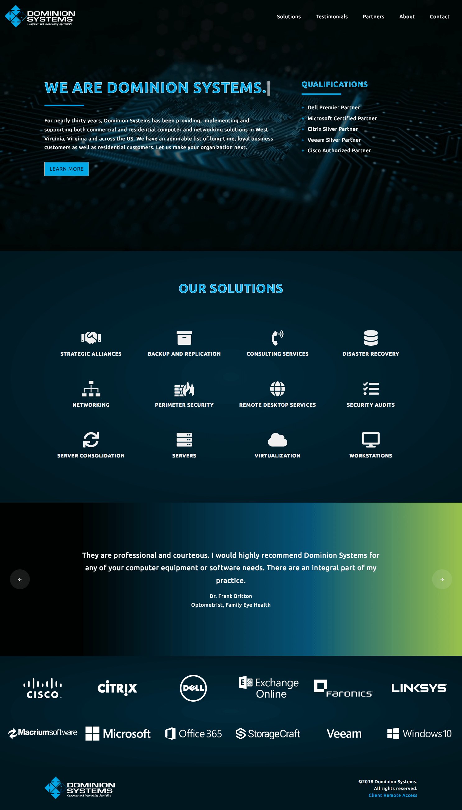

[Dominion Systems](https://www.dom-sys.com) has a long history of providing superior IT services to organizations in West Virginia, 36 other states and 5 other countries. Unfortunately their website hadn't grown with them. We were honored when they came to us to help guide them into a modern site they can be proud to share with clients and potential clients.

> I trust their methods and they're great to work with. I would recommend ThoseGeeks to anyone and will continue to do so. <cite>- Jody Meadows, Director of Technical Services and Support Management, Dominion Systems</cite>

Since Dominion Systems is a technology company, we saw an opportunity to apply some of the very new and interesting web technology. Dominion's new website is our first [JAMstack](/services/jamstack) project. If you're interested, you can read the specifics at the link, but the benefits are worth noting - speed, security and scaling. The end result is ridiculously fast.

