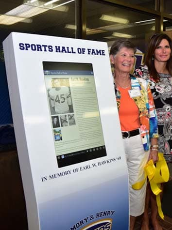

The [Emory & Henry College Sports Hall of Fame](http://hof.ehc.edu) celebrates the success of hundreds of former student-athletes, coaches, administrators, and contributors who have brought recognition, honor, distinction, and excellence to Emory & Henry’s athletic program.

Emory & Henry came to ThoseGeeks needing a backend and kiosk interface developed to bring the Hall of Fame to life. After consulting, we helped determine that a WordPress based web application would be ideal so that it could run in-browser on a kiosk as well as be accessible to the public.

After developing structure for the backend, Emory & Henry staff and volunteers went to work entering hundreds of inductees while we were designing and developing the frontend.

We also helped configure the kiosk browser for the public and the kiosk is available in the King Center on the Emory & Henry College campus [as well as online](http://hof.ehc.edu).

