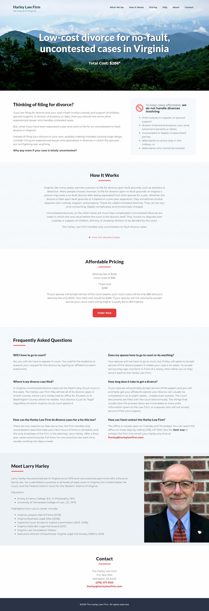

[The Harley Law Firm](https://www.harleylawfirm.com) specializes in no-fault, uncontested divorce cases in Virginia. Mr. Harley asked us to help build a simple site with some fancy bells and whistles behind the scenes.

Rather than going the WordPress route, which would have required multiple plugins which would've put us _close_ to accomplishing what Harley Law needed, we chose a static site with some serverless functions to handle the order form.

We designed the site as a single, scrolling page due to the short nature of each section of information. We opted to build the site with [Hugo](https://gohugo.io) to ensure the site will load as quickly as possible. Harley Law can log in and edit content via [Forestry](https://forestry.io).

The custom serverless function handles payment, does some custom processing to arrange the values in exactly the way the firm needs them, and then fires off notifications as appropriate. It's efficient, does exactly what the client needed and it was kind of fun to write. Who misses WordPress?

Check out [Harley Law Firm](https://www.harleylawfirm.com).
