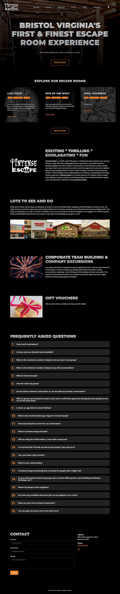
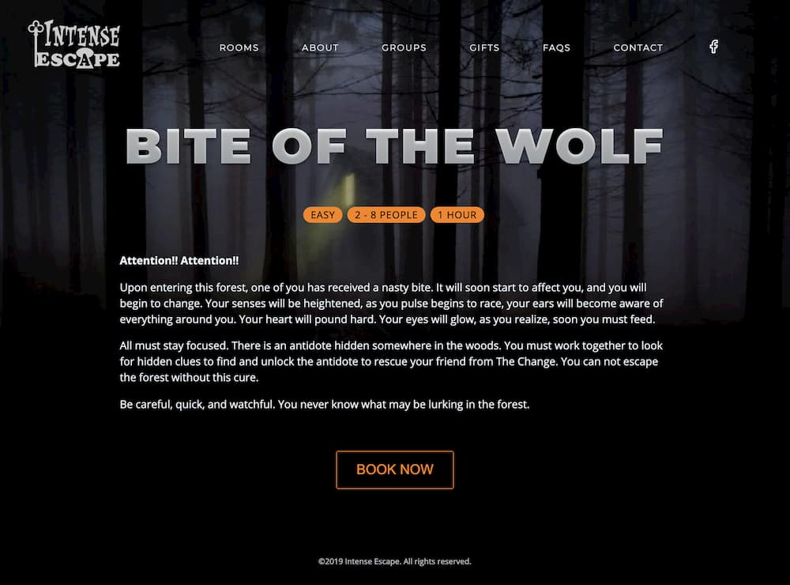

[Intense Escape](https://intenseescape.com) is a real life, action filled game. Locked in a specially designed room, your and your group must use codes to crack puzzles to solve and clues to aid you during your quest. Each room has a back story. Can you make it out in time?

When we were approached to build the site, one of the highest priorities for Intense Escape was search engine placement. Once we took a look at the competitions' sites, we determined we could leverage the JAMstack to create a much faster, more optimized site, which should please the Google overlords and provide Intense Escape an edge. The site is static, with no database queries, and is served from a content delivery network instead of from traditional hosting. The results is a very speedy site for visitors!

From a design perspective, we went with a dark and simple, nearly single-page site. Each section is designed to answer a visitor's questions as they scroll to learn more. Once the location has been open for a little while, we'll be incorporating reviews and photo galleries to make the site experience even more engaging!

Check out [Intense Escape](https://intenseescape.com).
