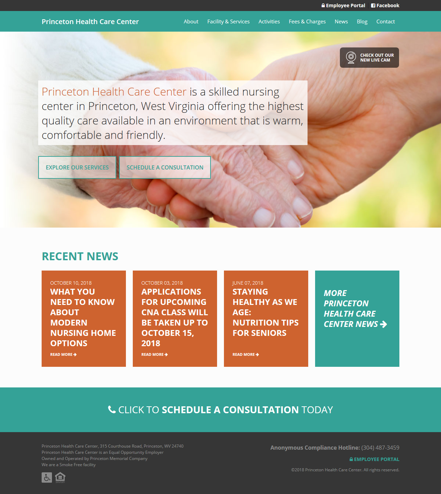
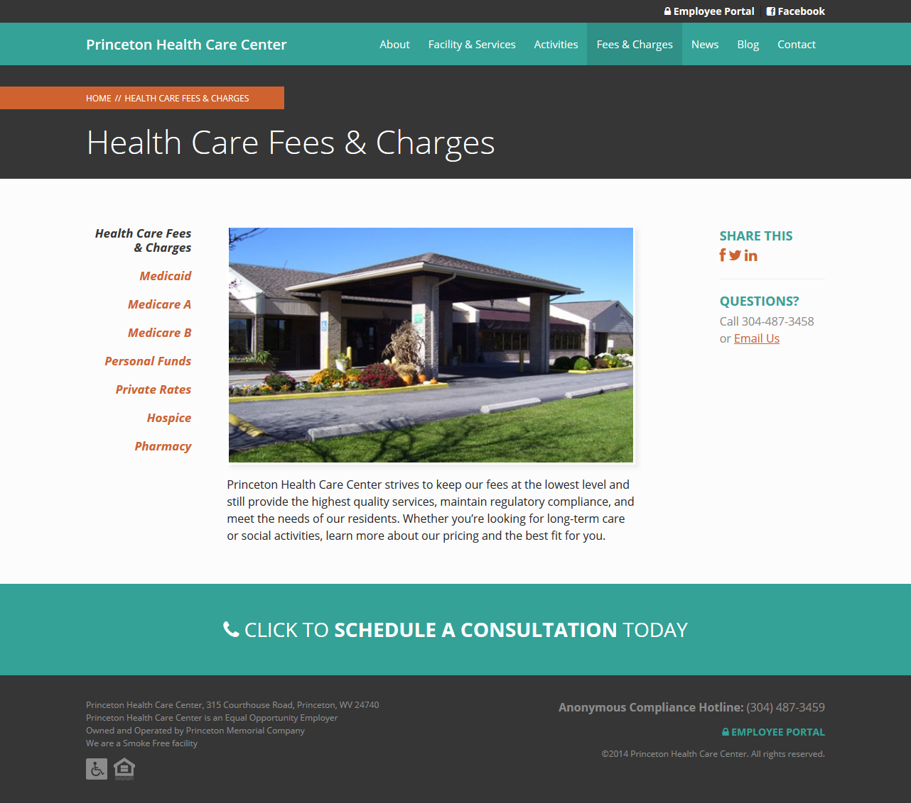

[Princeton Health Care Center](http://www.pmhonline.org) is a skilled nursing center in Princeton, West Virginia. We worked with PHCC to identify the top information website visitors need when visiting the site and organized our findings into a sensible sitemap. From there, we developed a professional, but approachable design which works great on desktop and mobile devices.

Consistent navigation and branding elements are featured throughout the finished site.

We also worked with PHCC to develop an intranet using WordPress as a backend. Employees can log into the employee portal to review and sign off on important updates and policies while administrators keep track.

Check out [Princeton Health Care Center](http://www.pmhonline.org) today.
