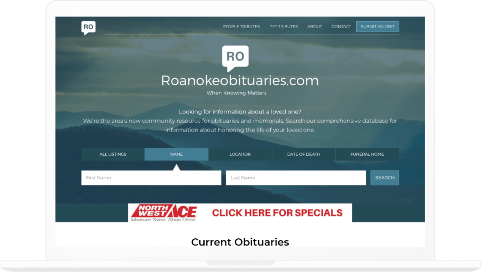
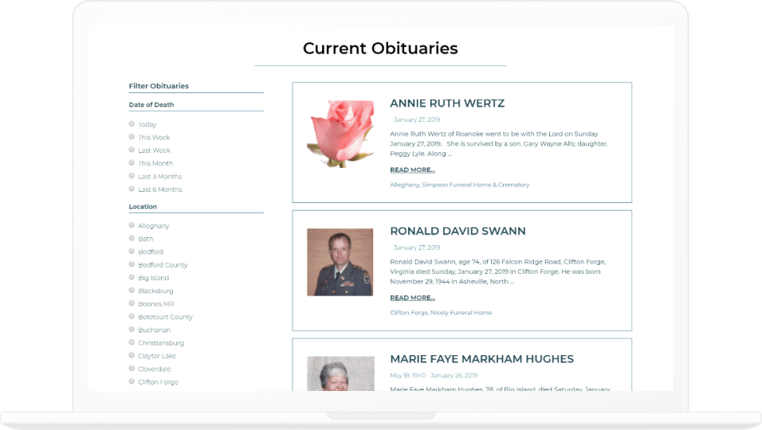

We're honored to have worked with Roanoke, VA designer, Kym Davis (who really needs to get her portfolio online...ahem...), for her client, [Roanokeobituaries.com](https://www.roanokeobituaries.com). This application provides an alternative to pricey traditional obituaries in newspapers which disappear after a while. With Roanokeobituaries.com, for one reasonable fee, obituaries can persist in a searchable fashion.

While Kym designed the site, ThoseGeeks handled the code. We opted to use WordPress for the site for several reasons:

- Several funeral homes needed the ability to log in and out of the application to post obituaries. WordPress handles users already.
- The obituaries, locations and funeral homes could all easily be handled with custom post types.
- The client needed some e-commerce functionality, which WordPress has lots of solutions for already.
- WordPress search could be modified to suit the desired filtering options of obituaries.

The result is a well-designed, functional resource for the Roanoke, VA area.

Visit [Roanokeobituaries.com](https://roanokeobituaries.com)
