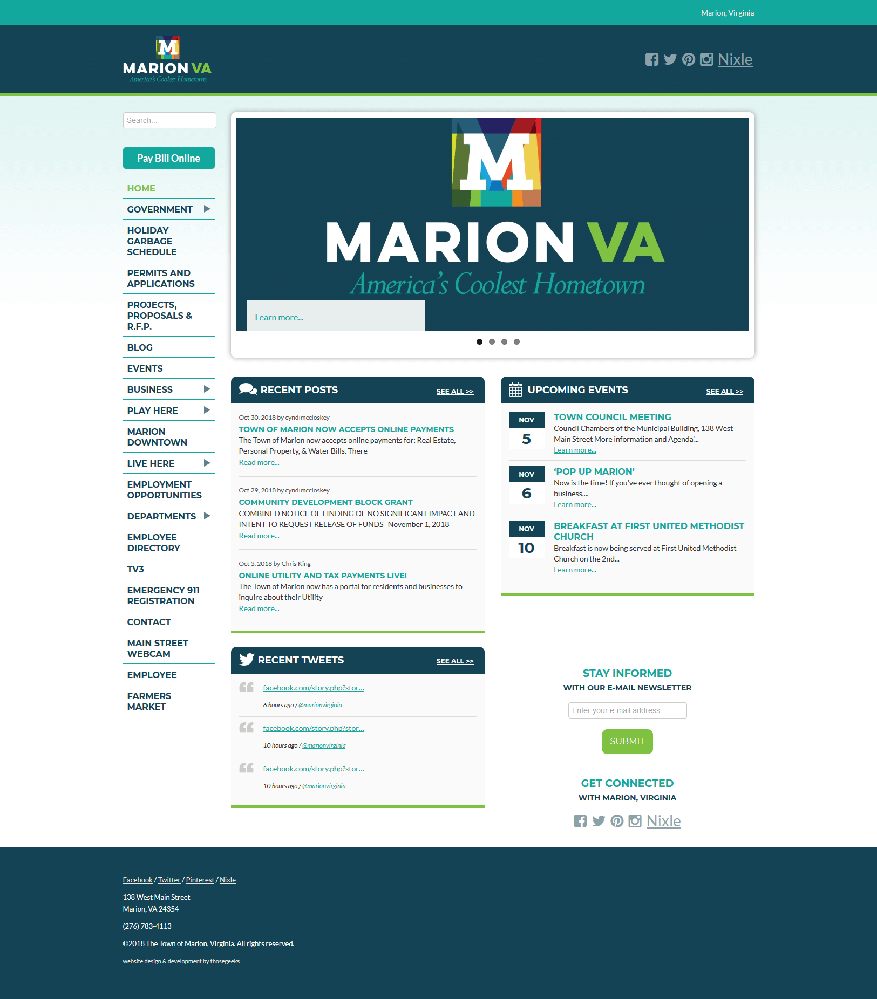
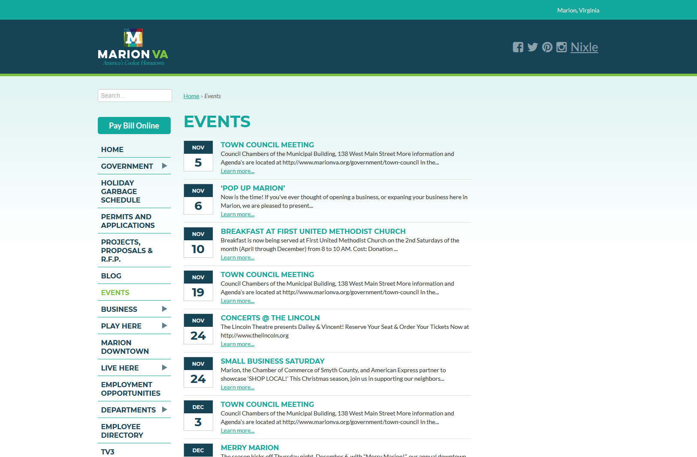
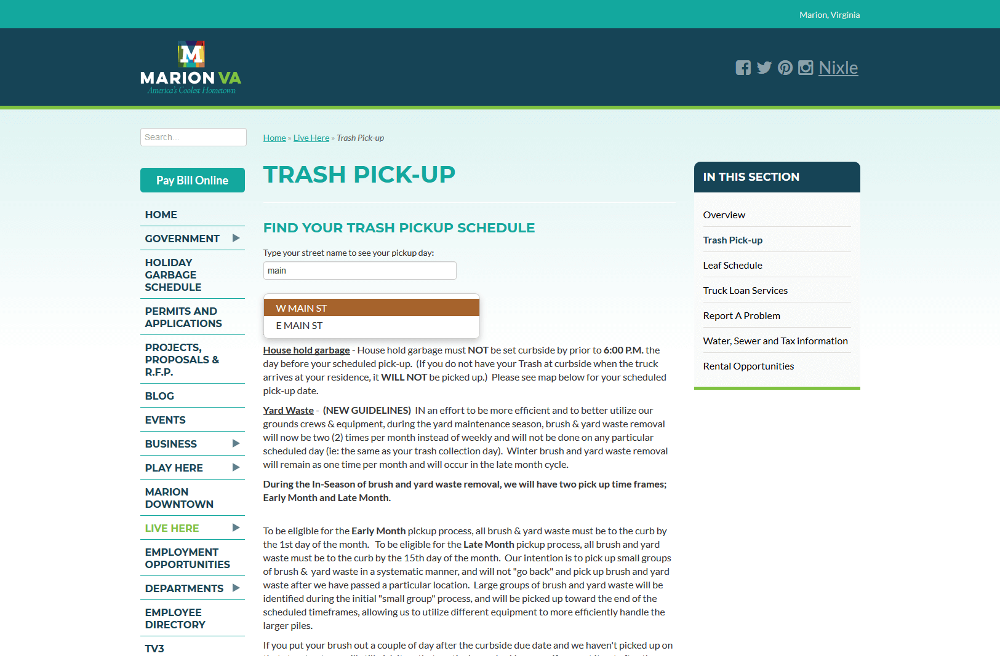

The [Town of Marion, Virginia](http://www.marionva.org) has accomplished some wonderful milestones over the last several years with nationally recognized downtown revitalization efforts, lots of public events and big focus on economic development.

Marion came to ThoseGeeks to develop a custom website which allows for easy updates, flexibility for future features and a requirement that the entire end product be under town ownership and control.

ThoseGeeks worked with the Town to develop a responsive website on ExpressionEngine.

Events are a huge part of the site - not only from the volume of events around the town, but also in terms of site traffic. The events section is the most highly used part of the new site.

We also had the opportunity to bake in a few neat, custom features like giving the ability for townsfolk to enter the street name and find out their leaf and trash pickup days.

