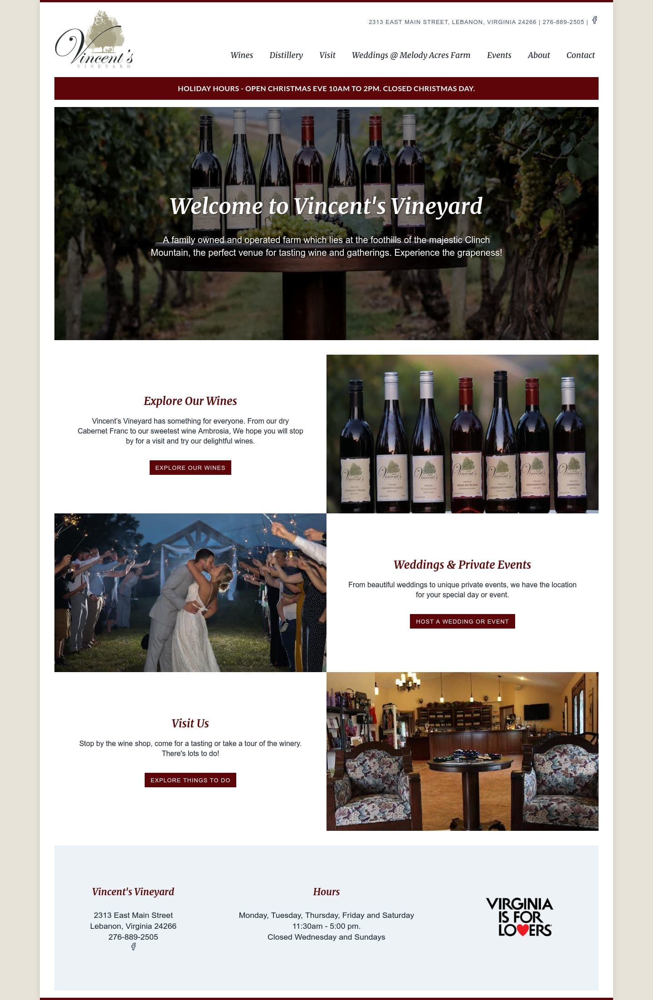
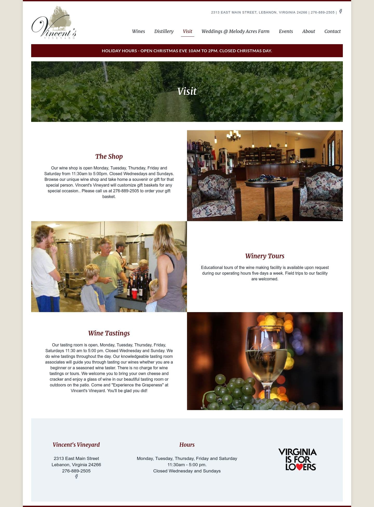

import LighthouseResult from "../../../components/LighthouseResult.js";

[Vincent's Vineyard](https://vincentsvineyard.com) is a family owned and operated farm which lies at the foothills of the majestic Clinch Mountain, a perfect venue for tasting wine and gatherings. Experience the grapeness!

## The Challenge

The previous site for the winery was made many years ago on Drupal. As time went on, the site was hacked numerous times and old usernames and passwords no longer worked. So the content became stale and was a big target for hacking. New information and content needed to be added, but it wasn't possible. The site needed help and we developed a plan.

## The Solution

To address the hacking concerns, we built the new site on the [JAMstack](https://jamstack.org). There is no traditional server to hack. There is no database to exploit. The entire site is built statically with [Hugo](https://gohugo.io).

We worked with Vincent's Vineyard's owners to gather all the correct information and began building out a nicer layout. We set up content editing with [Netlify CMS](https://www.netlifycms.org) so that the owners can log in and add events, update slideshow photos and text easily - all with no database!

## The Results

Vincent's Vineyard now has a solid, extremely fast and virtually unhackable website which is still editable! Here's a peak:

The new site scores green across all Google Lighthouse audit categories. We're proud of that!

<LighthouseResult performance={99} accessibility={100} bestPractices={100} seo={100} />

Check out [Vincent's Vineyard](https://vincentsvineyard.com)!
