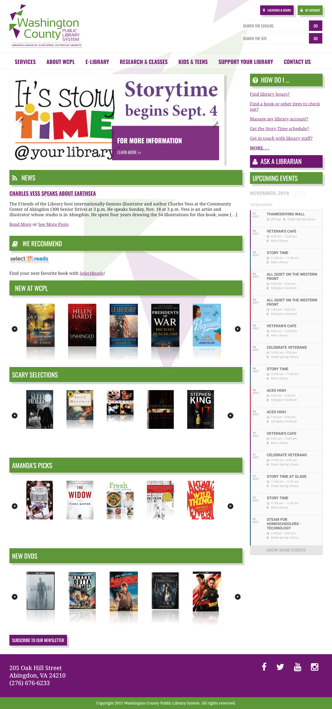

The [Washington County Public Library System](http://www.wcpl.net) has a main library in Abingdon as well as four satellite locations through Washington County, Virginia. The fine folks from WCPL met us at a WordPress workshop we were conducting and later gave us a shout to see if we could help them out.

WCPL was suffering from an abundance of ideas, but a website content management system so locked down, that it was either impossible to implement the ideas, or the implementation was far from ideal.

We worked with WCPL to design and build a brand new site from the ground up on WordPress. Now they have full control over menus, content and have an array of plugins at their disposal for every situation.

